# Introduction à Power BI

### Notes de cours
##### Préparées par Samuel Tremblay, VP-Éducation 2019-2020
#### Sommaire
1. L'interface de Power BI
  * Les rubans
  * Les panneaux
2. Introduction au modèle relationnel
  * Clé primaire & étrangère
  * Cardinalité des relations
  * Intégrité référencielle
3. Traitement des données
  * Éditeur Power Query
  * Mesures & colonnes calculées
4. Principes de visualisation
  * Comparer des données
  * Montrer la composition
  * Montrer la distribution
  * Montrer une relation
5. Projet dans Power BI
  * Importation
  * Traitement
  * Visualisation
  

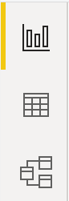

À gauche, vous retrouverez les trois principales sections de travail de Power BI :

 * **Rapport** : C'est l'interface utilisateur du rapport qui permet la création des visuels (*front-end*)
 * **Données** : Ce sont les les données que vous avez importées sous forme de tableur (*back-end*)
 * **Modèle** : C'est un schéma du modèle relationnel derrière les données qui est présenté (*back-end*)

Vous retrouverez, dans chacune de ces sections, les mêmes rubans hormis la section rapport qui en a un de plus.

---

### Les rubans
Les rubans sont situés dans le haut de l'interface utilisateur de Power BI. Ils sont au nombre de 4 : l'accueil, l'affichage, la modélisation et l'aide. Voyons un peu à quoi servent les trois premiers, le quatrième étant triviale.

#### Ruban d'accueil
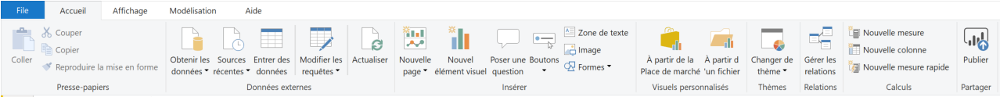

Le ruban d'accueil rassemble les actions permettant d'amorcer un projet de tableau de bord dans Power BI, d'ajouter des éléments visuels à une page ou encore d'ajouter une nouvelle page. 

La section « Données externes » permet d'importer des données dans le logiciel. Le bouton « Obtenir les données » sera ici le principal outil d'importation. Si la connexion était en temps réel avec une base de données, le bouton « Actualiser » permettrait de rafraîchir les données et visuels.

La section « Insérer » permet d'ajouter une multitude d'éléments visuels au rapport : des visualisations, formes, images, zones de texte, boutons, etc.

---

#### Ruban d'affichage

     

Le ruban d'affichage contient les options utiles afin d'adapter l'interface de Power BI à son style de travail. Il permet d'afficher un grillage, d'afficher des panneaux normalement cachés ou encore d'aligner les visualisations sur le grillage.

---

#### Ruban de modélisation
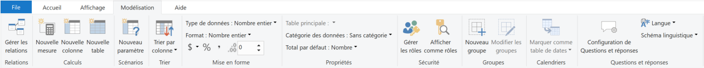

Le ruban de modélisation est le principal ruban lorsqu'il est question d'interagir avec les données. La section « Calculs » contient les outils nécéssaires à la création d'indicateurs de performance dérivés des données ou encore de colonnes utilisant la syntaxe DAX, de l'anglais *data analysis expressions*. DAX est la grande soeur des formules Excel, adaptée pour PowerPivot avec une logique de modèle relationnel à sa base.

La section « Mise en forme » permet de spécifier le format de données d'une colonne en particulier. C'est ici qu'il faut indiquer au logiciel si un nombre en un pourcentage, un montant d'argent, etc.

La section « Propriétés » permet aussi de spécifier le format de données mais pour des données spatiales. Différentes options incluent la ville, la région, le pays, etc. Si une colonne contient des liens vers des sites web, c'est aussi ici qu'il faut l'indiquer.

---

### Les panneaux
Les panneaux sont situés à droite de l'interface utilisateur de Power BI. Ils sont au nombre de 3 : filtres, visualisations et champs. Ils sont le principal outil afin d'interagir avec les visulisations du tableau de bord.

#### Panneau de filtres

Le panneau de filtres permet d'appliquer des filtres à un visuel, à une page ou au rapport en entier. Si vous désirez cacher un type de données en particulier (par exemple les chiffres de ventes d'un autre département) il ne faut pas appliquer un filtre sur le rapport au complet : l'usager pourra aisément le retirer. Il faut plutôt aller avec le *row-level security*, un concept qui ne sera pas couvert dans le cadre de ce cours.

Une fois un filtre appliqué, une série d'options s'offre à vous. En fonction du type de données, vous pourrez choisir la manière d'appliquer le filtre. Pour une date par exemple, il est possible de définir une série de dates (mai 2018 et juin 2017), un intervalle de dates (entre mai 2018 et juin 2017) ou encore un seuil (plus vieux que mai 2018).

---

#### Panneau de visualisations

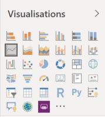

Le panneau de visualisation est le panneau le plus complexe et celui dont vous vous servirez le plus souvent afin de personnaliser les paramètres des visuels par défaut de Power BI. L'image à gauche montre le haut du panneau, qui sert à sélectionner le type de visuel. Les visuels par défaut de Power BI s'arrête à l'image de « Py », pour Python. 

En effet, le logiciel supporte les visuels personnalisés codés en R ou Python. Ceux-ci ne sont cependant pas interactifs. C'est après ce symbol que commencent les visuels provenant de la Place de marché. Plus bas, vous retrouverez 3 onglets.

---

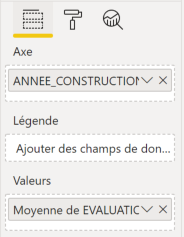

Le premier onglet est celui permettant de sélectionner les données à utiliser en glissant des attributs dans différents champs, lesquels varient selon le type visuel choisi. 

Fait important : lorsqu'un attribut est glissé dans le champ « valeurs », Power BI utilise par défaut la somme de ce champ. Il faut donc être prudent afin de sélectionner la bonne méthode d'aggrégation des données.

Les visuels supportent aussi la coloration en fonction d'une variable catégorielle, par exemple. Ceci est possible via le champ « Légende ». Ainsi, si un nuage de points représente un groupe aux catégories d'âge variées, y glisser l'attribut colorera les points automatiquement.

---

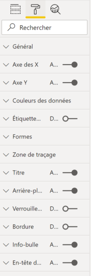

Le second onglet est celui contenant l'ensemble des options de personnalisation graphique du visuel. S'il y a un détail à l'oeil qui vous dérange, il y a 100% de chances qu'il soit possible de le changer grâce à cet onglet. Il est donc important de bien fouiller dans cette section afin de trouver le paramètre que vous voulez personnaliser.

Titre du graphique, couleur des points, grosseur du trait, titres des axes... Tout s'y trouve. En fonction du visuel, des paramètres supplémentaires peuvent aussi être disponibles.

Les noms des sections sont assez explicites mais parfois un paramètre peut parfois être bien caché : Seule l'expérience vous permettra de trouver rapidement où aller.

---

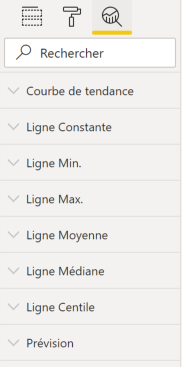

Le troisième et dernier onglet contient les fonctions analytiques proposées par Microsoft pour chacune des visusalisations. C'est ici, par exemple, que se retrouve l'option d'ajouter une ligne de tendance (régression linéaire) pour une visulisation de type « nuage de points ».

Cet onglet n'est pas toujours disponible puisque certaines visualisations ne supportent tout simplement pas de méthodes analytiques avancées : pensons aux tableaux, par exemple. Les séries temporelles permettent de faire de l'auto-régression en spécifiant quelques paramètres. La documentation de Power BI explique quelle méthode est utilisée.

---

#### Panneau de champs

Le panneau champs est l'endroit où sont rassemblées toutes les données que vous avez importées jusqu'à présent. Celles-ci sont affichées par table, qui montre les différentes colonnes lorsque vous la cliquez. Le symbole de sommation indique une donnée numérique qui supportera différents modes d'agrégation (sommation, moyenne, maximum, etc.).

Dans l'exemple à gauche, quatre tables ont été importées ; la table « immeuble_id » contient deux colonnes, dont une qui est numérique, « TYPE_TRANSACTION ».

Le carré à gauche de chaque colonne permet de cocher un attribut afin qu'il soit utilisé dans le visuel présentement sélectionné. C'est une option alternative à glisser l'attribut vers le premier onglet du panneau de visualisation.

 

Le modèle relationnel est une philosophie de gestion des bases de données basée sur l'existence d'uplets, reliés entre eux par des relations. On dit alors qu'une base de donnée organisée selon ce modèle est une base de données relationnelle.

### Clé primaire & étrangère

Chaque entrée d'une table doit posséder un identifiant unique, qu'on qualifie de « clé primaire ». Le matricule HEC est un bon exemple de clé primaire. Ainsi, les caractéristiques communes d'un enregistrement doivent être regroupées dans une même table (âge, sexe, nom, etc), c'est-à-dire liées à la clé primaire

Une clé étrangère permet d'effectuer la liaison avec une autre table, laquelle n'a pas la même clé primaire. Les cours suivis sont un bon exemple de ce concept. Ici, la clé primaire serait l'identifiant du cours, tel que MATH101 par exemple, et le matricule étudiant serait, de ce point de vue, une clé étrangère.

Power BI détecte automatiquement les relations entre les tables lorsqu'elles sont ajoutées. Il va donc assigner une cardinalité en plus de déterminer quelles sont les clés à retenir. Il faut cependant vérifier qu'il ne s'est pas trompé.

---

### Cardinalité des relations

La cardinalité est un concept très important du modèle relationnel. Si la cardinalité est mal spécifiée, Power BI peut aggréger de façon incorrecte les données. Il existe trois types de cardinalité :

* **1 à 1** : Pour chaque entrée dans la table A, la table B a une entrée.
* **1 à N** : Pour chaque entrée dans la table A, il y a N entrées dans la table B.
* **M à N** : Pour M entrées dans la table A, il y a N entrées dans la table B.

Le concept de cardinalité M à N peut être difficile à saisir. Un exemple concret de ce type de relation est le suivant : un étudiant peut être inscrit à plusieurs classes et une classe peut avoir plusieurs étudiants. Ainsi, plusieurs étudiants ont plusieurs classes et vice-versa.

### Éditeur Power Query
Le ruban d'accueil possède un bouton « Modifier les requêtes ». Cliquer dessus ouvre une nouvelle fenêtre, l'éditeur *Power Query*, lequel permet de programmer différentes étapes de transformation sur les données. Power BI effectue par défaut des opérations comme promouvoir la première ligne en en-têtes de colonnes ainsi que de changer le type de données de chaque colonne selon ce qu'il détecte. Ces étapes sont rassemblées à droite, dans la section « ÉTAPES APPLIQUÉES ». Les étapes inscrites ici seront effectuées à chaque fois que la source de données sera rafraîchie.

#### Ruban transformer

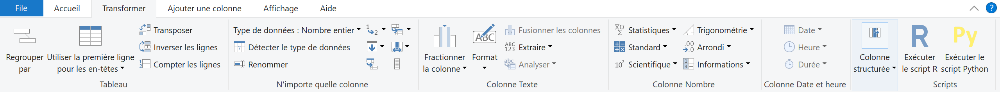

Ce ruban rassemble une série d'opérations de base sur les données : modifier leur type, renommer une colonne, promouvoir les en-têtes, fusion/séparation de colonnes... C'est aussi ici qu'il est possible de transposer la table, si nécessaire. Enfin, si vous avez un script R ou Python qui effectue un nettoyage des données plus complexe que ce qui est proposé par Power BI, vous pouvez l'ajouter aussi afin qu'il s'exécute automatiquement à chaque rafraîchissement.

---

#### Ruban ajouter une colonne

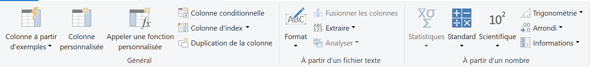

Ce ruban permet d'ajouter des colonnes personnalisées. Que ce soit avec une formule DAX ou par concaténation (comme dans le ruban précédent), cette colonne sera créée et calculée à chaque fois que les données sont rafraîchies.

---

### Mesures & colonnes calculées

Revenons à l'interface principale de Power BI. Le ruban modélisation propose trois options dans la section « Calculs » :

 * **Nouvelle mesure** : Une mesure calcule une fonction DAX agrégée selon les paramètres d'un visuel précis. Par exemple, si une mesure est définie comme la somme des ventes est placée dans un visuel, les différents filtres appliqués au visuel modifieront à leur tour la mesure. Celle-ci est à prévilégier lorsque l'information calculée n'a pas besoin d'être stockée ou d'être sélectionné par l'utilisateur.
 * **Nouvelle colonne** : Contrairement à la mesure, la colonne entrepose, pour chaque ligne, le résultat de la formule DAX. Cette colonne peut alors être utilisée dans des visuels ou pour calculer d'autres colonnes. Puisqu'elle est sauvegardée, elle alourdie la taille du fichier `.pbix`.
 * **Nouvelle table** : En pratique, ce bouton est peu utilisé.

Avant de créer vos visuels, il est important de rappeler quelques principes de base de la visulisation de données. Les gens ont parfois tendance à créer de magnifiques visuels toujours plus complexes les uns que les autres qui perdent de vue leur objectif premier : communiquer de l'information.

### Comparer des données

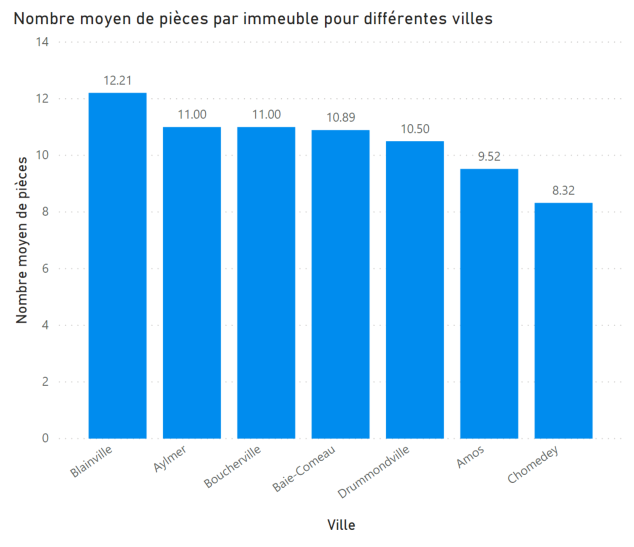

C'est souvent la principale tâche d'un ou d'une analyste : comment va notre organisation versus la compétition? La principale règle à respecter est de comparer des pommes avec des pommes ou, s'il faut comparer des pommes avec des poires, utiliser la même métrique pour les comparer, comme par exemple le volume de ventes. On utilise alors le **diagramme à bandes**.

L'exemple à droite permet de voir le nombre de pièces moyen pour différentes villes québécoises.

    

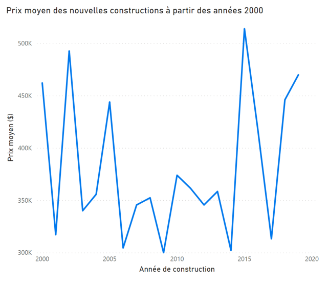

On désire aussi souvent comparer l'évolution sur le temps : on parle alors de séries temporelles. Le visuel à utiliser ici est le **graphique en courbes**.

L'exemple à droite permet de voir l'évolution, à partir de l'an 2000, du prix moyen des nouvelles constructions.

        

---

### Montrer la composition

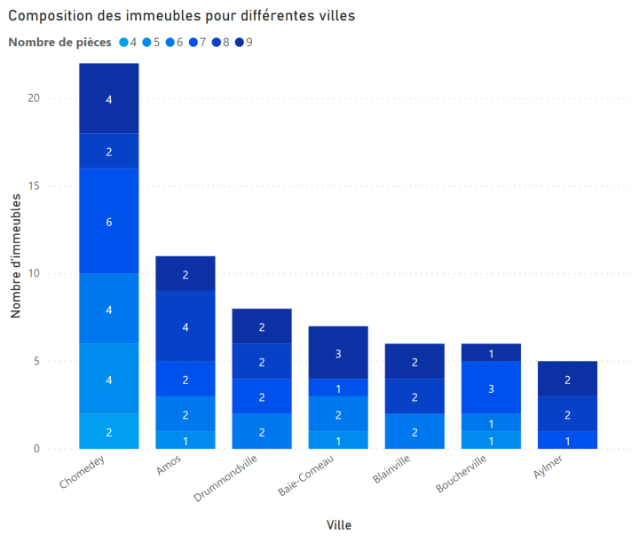

On veut voir comment se décompose une variable. Par exemple, quels sont les les pays qui achètent le plus de nos produits, de 2015 à aujourd'hui. Il faut alors faire appel aux visuels « empilés » :  **diagramme à bandes empilées**, **graphique de zone empilé** ou **histogramme empilé**.

L'exemple à droite permet de voir le nombre d'immeubles qui ont 4, 5, 6, 7, 8 ou 9 pièces pour chaque ville.

     

---

### Montrer la distribution

À ne pas confondre avec la composition, on cherche ici à montrer une tendance ainsi que des possibles valeurs extrêmes. Power BI est un peu capricieux vis-à-vis la production d'**histogrammes** (malgré une visualisation qui s'appelle ainsi) : il faudra donc être créatif et utiliser Gooogle.

---

### Montrer une relation

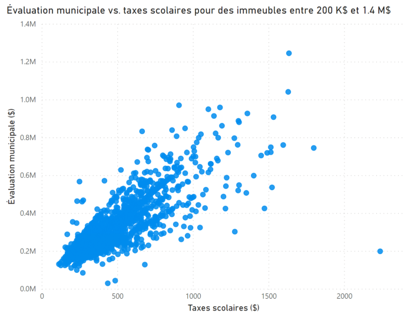

On cherche à déterminer s'il existe une corrélation entre deux variables. La visualisation à utiliser est évidemment le **nuage de points**.

L'exemple à droite montre la corrélation évidente entre les taxes scolairs payées et l'évaluation municipale d'un immeuble.

### Importation

Pour commencer, il faut importer les fichiers de données suivants, qui se trouvent dans le dossier data :
 1. immeuble_adresse.csv
 2. immeuble_caracteristique.csv
 3. immeuble_finance.csv
 4. immeuble_id.csv

Vérifier le schéma relationnel des données. Celui-ci a-t-il été correctement généré? Quelle est la clé primaire? Est-ce qu'il y a des clés étrangères? Quelle est la cardinalité des relations?

### Traitement

Afin de répondre aux questions de recherche de la prochaine section, il est nécessaire de créer quelques colonnes calculées :
 1. TAX_TOT, en additionnant les taxes municipales et les taxes scolaires
 2. TAX_TOT_10K, qui indique si le total des taxes est supérieur ou inférieur à 10 000$, grâce à `IF(COND, TRUE, FALSE)`
 3. RATIO, en divisant l'évaluation du terrain par celle du bâtiment grâce à la fonction `DIVIDE(NUM, DENUM)`

Que se passe-t-il si la fonction `DIVIDE()`n'est pas utilisée?

### Visualisation

Vous devez produire les visualisations appropriées permettant de répondre aux 4 questions suivantes :
 1. Quels sont les arrondissements où le RATIO moyen précédemment calculé est le plus élevé? Que pensez-vous que ces arrondissements sont? Ne conservez que les ratio moyens supérieurs à 1.5 pour alléger le visuel.
 2. Quels sont les codes postaux où la moyenne des taxes totales payées est la plus élevées? Utiliser un visuel afin de représenter géographiquement où se situent ces codes postaux. Faites attention à ne pas surcharger le visuel.
 3. Est-ce qu'il y a une corrélation entre les taxes municipales payées et le nombre de pièces de l'immeuble? 
  * Ajouter une coloration selon la région, puis filtrer pour garder uniquement Montréal, Laval et Sherbrooke. Que constatez-vous?
 

