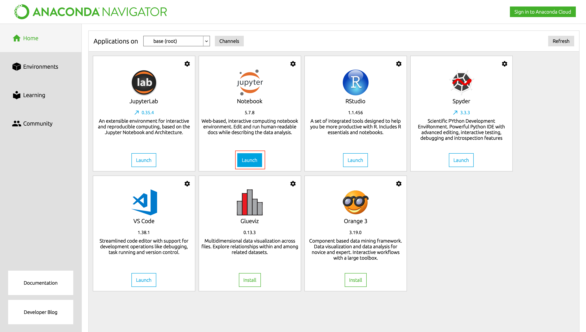
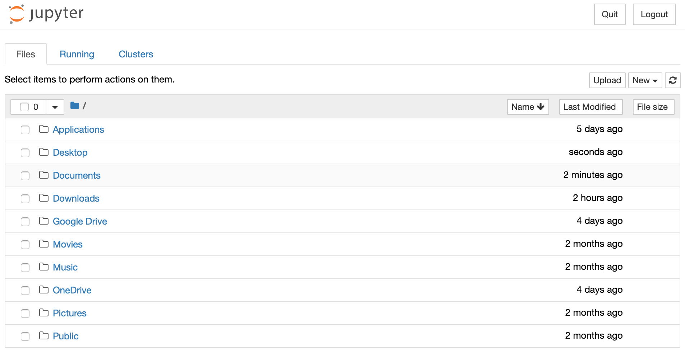
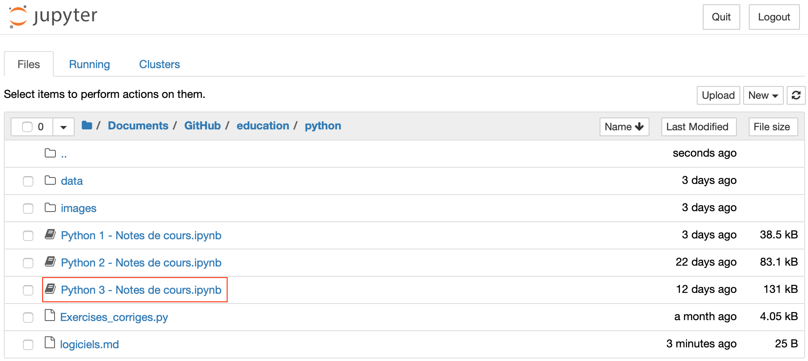
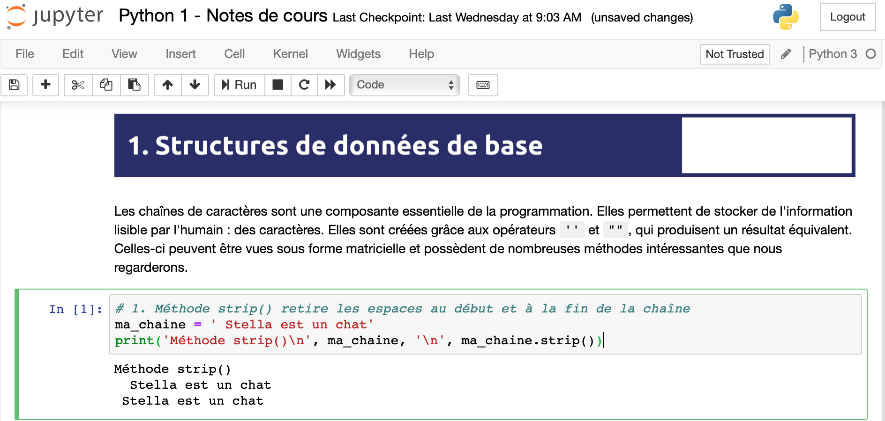
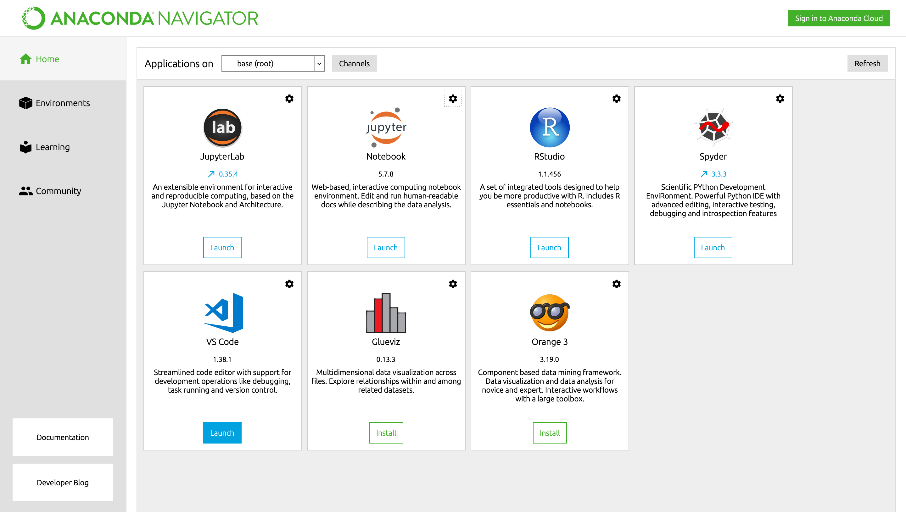
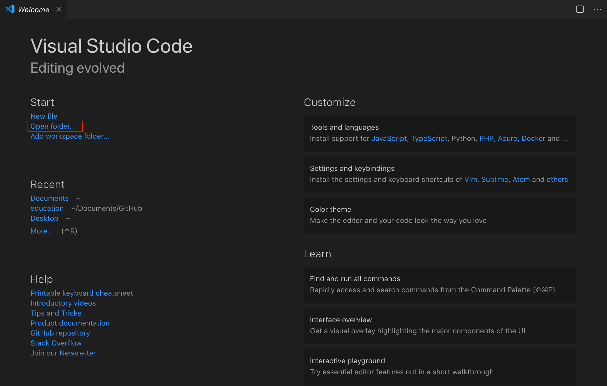
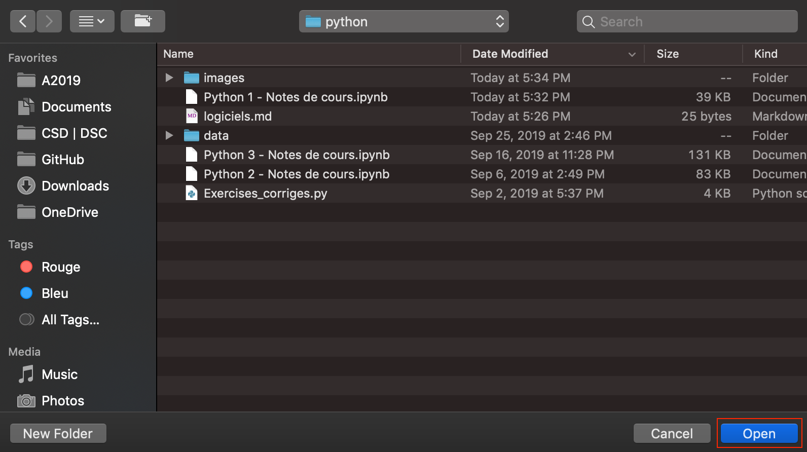
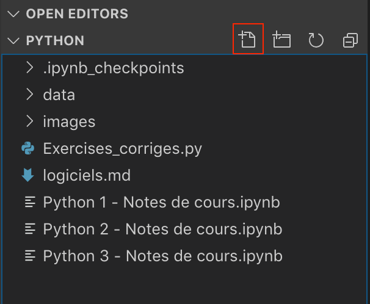
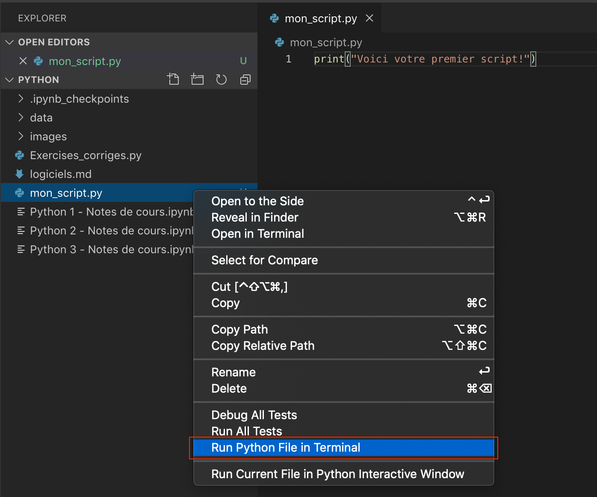
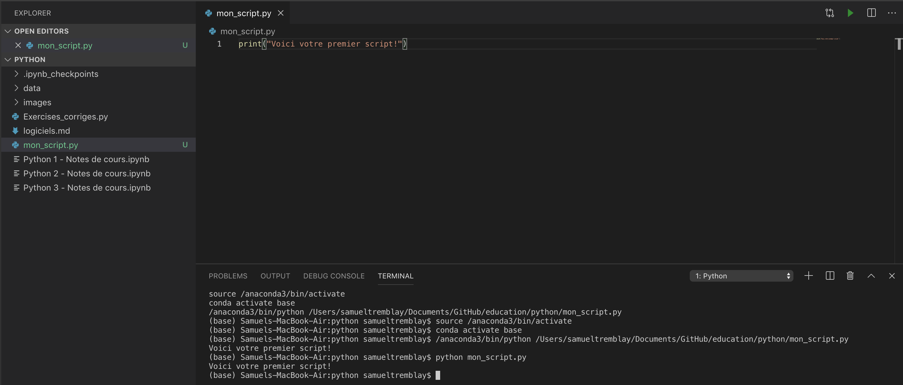

# Utilisation des logiciels

## Accéder aux Jupyter Notebook

1. Lancer le Anaconda Navigator et cliquer sur le bouton pour lancer l'application Jupyter Notebook. Vous devrez l'installer au préalable. Une fois l'installation terminée, vous pourrez la lancer.



2. Attendre que la page d'accueil suivante s'affiche, puis naviguer jusqu'à l'emplacement du sous-dossier Python du GitHub education.



3. Cliquer sur l'atelier auquel vous désirez accéder.



4. Le Jupyter Notebook va se lancer. Pour exécuter un bloc de code, sélectionner celui-ci et appuyer sur le bouton « Run ».



## Utiliser Visual Studio Code

1. Lancer le Anaconda Navigator et cliquer sur le bouton pour lancer l'application Visuel Studio Code (VS Code). Vous devrez l'installer au préalable. Une fois l'installation terminée, vous pourrez la lancer.



2. Attendre que la page d'accueil suivante s'affiche, puis cliquer sur « Open folder... ».



3. Naviguer jusqu'à l'emplacement du sous-dossier Python du GitHub education et cliquer sur « Open ».



4. Vous verez le menu suivant apparaître à gauche. Cliquer sur l'icône afin de créer un nouveau script. Ne pas oublier de terminer son nom par ```.py```.



5. Une fois le script prêt à être exécuté, effectuer un clique droit dessus et sélectionner l'option en bleu.



6. Le terminal va s'initialiser et votre script va s'exécuter. Pour l'exécuter à nouveau, écrire directement ```python```suivi du nom de votre script dans le terminal.


